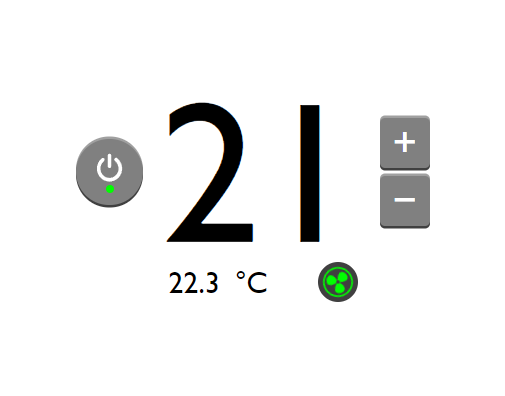
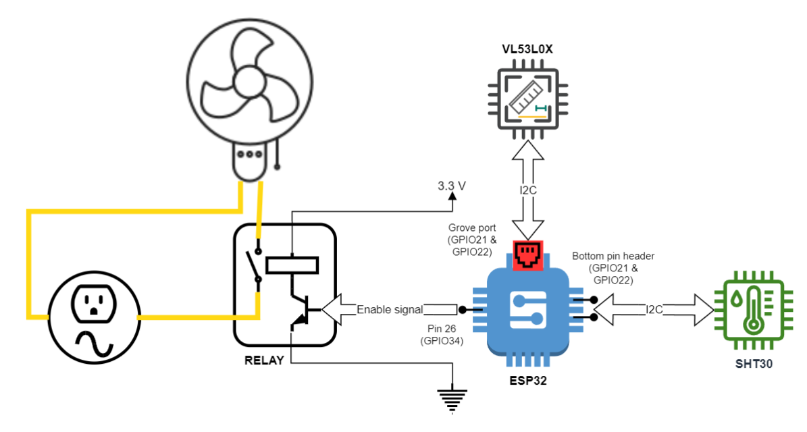

# SmartFan (a group school project)

An IoT project that lets you control a fan with a web application.



*Appearance of the web application's UI*


## Design

The project consists of a Flask server and an internet-enabled device. The server provides a REST API and a web application. The device talks to the server and controls a fan.


### Device



*Schematic diagram of the device*

The device is an M5Stack Basic Core IoT Development Kit with an ESP32 microcontroller. It reads the room's temperature using a SHT30 temperature sensor, and uses a VL53L0X ToF sensor to detect the presence of the user. A relay is used to switch a fan on or off.

For testing purposes an emulator was written in Python, found at `microcontroller/emulator`, that emulates the behaviour of the C code running on the microcontroller, and sends mock data to the server.


### REST API

All communication is done via the REST API. It provides an interface through which the device can report its status to the web application, and through which the web application can configure the device.

The API has two endpoints:

| Endpoint | Description |
|-|-|
| smart-fan/device | GET and POST access to device status |
| smart-fan/device/configure | GET and POST access to device configuration |

Format of the status JSON:

```json
{
    "temperature": number,
    "fan_active": boolean,
    "seconds_since_last_connection": number,
    "configuration":
    {
        "target_temperature": number,
        "fan_enabled": boolean
    }
}
```

Format of the configuration JSON:

```json
{
    "target_temperature": number,
    "fan_enabled": boolean
}
```

The HTTP header's `X-Api-Key` field is used for authorization.


## Usage

Once both the server and the device are online, the web application can be used to monitor and control the fan. The web application is located at the `/smart-fan/dashboard/` endpoint. A GET parameter `AUTH-KEY` with the value of the API key has to be provided to allow the application to get authorized by the REST API.


## Note

This is a proof of concept. It does not meet modern security standards and supports only one device.


## More information

Further information is available in Slovene language in [the report](docs/report.pdf).